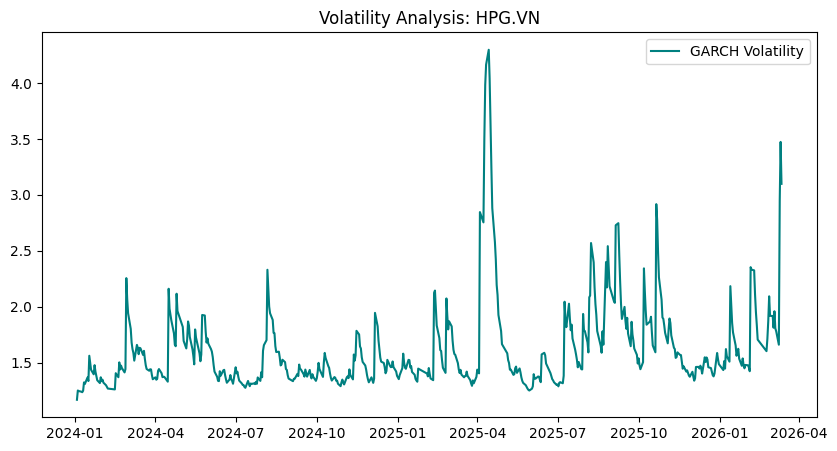

# 📈 Volatility Forecasting & Portfolio Optimization Engine

## 🌟 Executive Summary
This project demonstrates an end-to-end Quantitative Finance pipeline. It combines **GARCH(1,1)** models for risk forecasting with **Modern Portfolio Theory (MPT)** to visualize the Efficient Frontier for Vietnamese equities (VN30).

---

## 📊 Key Results
* **Volatility Prediction:** Successfully captured volatility clustering in HPG.VN during market fluctuations.
* **Risk Metric:** Predicted a 5-day forward-looking volatility horizon, essential for VaR (Value-at-Risk) models.
* **Optimization:** Identified the optimal Sharpe Ratio within a simulated 3-asset portfolio (HPG, VCB, VIC).

---

## 📂 Dataset & Methodology
* **Source:** Live financial data via Yahoo Finance API (`yfinance`).
* **Timeframe:** Jan 2024 - Present.
* **Models:** * **GARCH(1,1):** $\sigma^2_t = \omega + \alpha \epsilon^2_{t-1} + \beta \sigma^2_{t-1}$
  * **Efficient Frontier:** Monte Carlo simulation of 2,000 portfolio combinations.

---

## 🖼️ Outputs
### 1. Conditional Volatility (GARCH)

*(Note: Replace this with your volatility_report.png)*

### 2. Efficient Frontier Chart

*(Note: Replace this with your efficient_frontier.png)*

---

## 🛠️ How to Run
1. **Clone the repo:** `git clone https://github.com/YourUsername/Volatility-Forecasting-Engine.git`
2. **Install dependencies:** `pip install -r requirements.txt`
3. **Run the engine:** `python main.py`

---

## 🔑 Key Takeaways for Quant Research
1. **Log Returns vs Price:** Financial time series must be stationary; using Log Returns ensures the integrity of the GARCH model.
2. **Clustering Effect:** High-volatility periods tend to be followed by high-volatility periods, a phenomenon captured effectively by this engine.
3. **Risk-Adjusted Return:** Focus is not just on profit, but on maximizing return per unit of risk (Sharpe Ratio).

---

**Author:** Chi Nguyen | Master of Financial Management (University of Melbourne)
